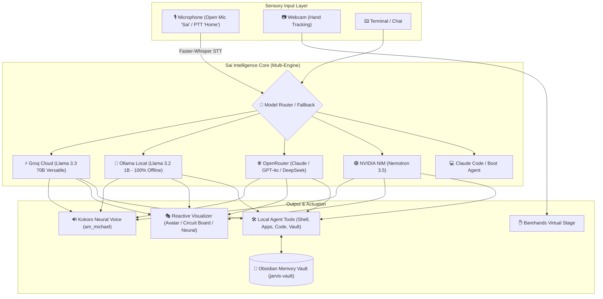

# Sai AI — My Own Jarvis 🤖⚡

An omnipresent, personal full-stack AI desktop assistant with persistent memory, multi-model intelligence, real-time voice, reactive visual faces, and computer-vision gesture controls integrated into the Windows desktop environment.

---

## 📑 Table of Contents

- [Overview & Architecture](#-overview--architecture)
- [Multi-Model Engine Hub](#-multi-model-engine-hub)
- [Sensory & Interaction Subsystems](#-sensory--interaction-subsystems)
- [On-Device Tools & Capabilities](#-on-device-tools--capabilities)
- [Installed Skills](#-installed-skills)
- [Project Directory Structure](#-project-directory-structure)
- [Startup & Desktop Launchers](#-startup--desktop-launchers)
- [Model Configuration (`backtalk.json`)](#-model-configuration-backtalkjson)
- [License & Credits](#-license--credits)

---

## 🚀 Overview & Architecture

**Sai AI** is built on the philosophy of a **"Full Stack Agent"** — an AI assistant that doesn't just write code, but possesses a complete sensory and interactive embodiment:
- **A Mind** (Persistent memory vault that survives sessions)
- **A Voice & Ears** (Low-latency speech-to-text, neural TTS, wake word, and push-to-talk)
- **A Face** (Dynamic reactive visualizers and 3D avatar reflecting conversation states)
- **A Set of Hands** (Webcam gesture tracking for manipulating notes and boards)
- **Local PC Superpowers** (PowerShell execution, app launching, system metrics, code running)



---

## 🧠 Multi-Model Engine Hub

Sai is integrated with multiple AI inference engines with dynamic switching and fallback capabilities:

| Provider | Default Model | Mode | Role & Capabilities |
| :--- | :--- | :--- | :--- |
| **⚡ Groq** | `llama-3.3-70b-versatile` | Cloud | Ultra-low latency inference (~1s spoken response cycle), high reasoning power for daily chat and voice. |
| **🦙 Ollama** | `llama3.2:1b` (`http://127.0.0.1:11434`) | Local / On-Device | 100% offline, privacy-first local intelligence with zero internet required. |
| **🌐 OpenRouter** | Multi-model routing | Cloud | Access to flagship models (`GPT-4o`, `Claude 3.5 Sonnet`, `DeepSeek-V3`, `Llama 3.3`). |
| **🟢 NVIDIA NIM** | `Nemotron 3.5` | Cloud | High-throughput GPU-accelerated enterprise models. |
| **💻 Claude Code** | Anthropic Engine | CLI / Boot | Deep coding tasks, repository refactoring, and initial system installation. |

---

## 🎙️ Sensory & Interaction Subsystems

### 1. 🧠 The Mind: `ai-memory-vault` & `jarvis-vault`
- **Location**: `C:/Users/saisi/jarvis-vault`
- **Mechanism**: Plain-text Obsidian-compatible Markdown vault that Sai reads and writes autonomously.
- **Features**:
  - `01 - Daily Notes/`: Daily logs backfilled with conversation context.
  - `Active Priorities.md`: Open tasks, goals, and follow-ups.
  - `VAULT-INDEX.md`: Master map of memory and user profile.
  - Zero context ceiling — memory persists forever across reboots.

### 2. 👂 The Ears & 🗣️ The Mouth: `backtalk`
- **Speech-to-Text (STT)**: Faster-Whisper (`base.en` / local models) with audio ducking.
- **Text-to-Speech (TTS)**: Kokoro Neural Voice (`am_michael` at 1.30x speed).
- **Trigger Modes**:
  - **Open Mic**: Listens continuously for the wake word `"Sai"` or `"Hey Sai"`.
  - **Push-to-Talk (PTT)**: Press and hold the `Home` key to speak instantly.
- **Thinking Sounds & State Files**: Emits real-time waveform signals (`.voice_waveform`, `.voice_state`) to sync the UI.

### 3. 🎭 The Face: `ai-visualizer`
- Full-screen reactive interfaces running locally via Python/HTML5:
  1. **`avatar`**: Interactive 3D cybernetic face model.
  2. **`board`**: Living circuit board with animated pathways.
  3. **`neural`**: Synaptic neural network firing in sync with thinking/speech.
  4. **`radial`**: Harmonic radial frequency visualizer.
  5. **`rain`**: Matrix cyber digital rain.
- **States**: Seamless transitions between `idle`, `listening`, `thinking`, and `speaking`.

### 4. ✋ The Hands: `barehands`
- Webcam computer vision hand-tracking interface.
- Manipulate cards, notes, diagrams, and presentation elements on a 3D canvas using hand gestures without VR controllers.

---

## 🛠️ On-Device Tools & Capabilities

Located in `backtalk/backtalk/agent_tools.py`, Sai is equipped with native Windows execution capabilities:

- **💻 Shell & PowerShell Executor**: Runs terminal commands and scripts in the workspace.
- **📝 Code Generator & Runner**: Writes code files directly to `jarvis-vault/Code` or `my-agent/workspace` and executes Python scripts.
- **🚀 App & Game Launcher**: Voice-activated launching for Spotify, Discord, VS Code, Browser, and games.
- **✉️ Draft Manager**: Drafts emails and notes directly into `jarvis-vault/Drafts`.
- **📸 Screenshot Capture**: Captures desktop screen snapshots into `jarvis-vault/Screenshots`.
- **📊 System Monitor**: Real-time inspection of CPU usage, RAM, battery levels, and active window processes via `psutil`.

---

## 🧩 Installed Skills

- **`kokonut-ui`** (`.agents/skills/kokonut-ui`): Library of 100+ animated React/Tailwind components (AI inputs, liquid glass cards, beam backgrounds).
- **`find-ui-templates`** (`.agents/skills/find-ui-templates`): Web curation skill for locating cutting-edge UI/website design references and templates.

---

## 📁 Project Directory Structure

```text
c:\Users\saisi\
├── my-agent/
│   ├── CLAUDE.md                   # Pinned agent boot identity & core rules
│   ├── fullstack-agent/            # Agent management & orchestration
│   │   ├── start.bat / start.sh    # Main service orchestrator
│   │   ├── update.bat / update.sh  # Auto-updater script
│   │   └── fullstack-agent.md      # Setup wizard & documentation
│   ├── backtalk/                   # Voice & Multi-Engine Brain
│   │   ├── backtalk.json           # Model keys, providers, audio config
│   │   └── backtalk/
│   │       ├── brain.py            # Groq / Ollama / OpenRouter / NVIDIA router
│   │       ├── agent_tools.py      # On-device PC execution tools
│   │       ├── ears.py             # Whisper STT & wake-word engine
│   │       ├── mouth.py            # Kokoro neural TTS synthesis
│   │       └── ptt.py              # Push-to-talk handler
│   ├── ai-visualizer/              # Reactive UI & Faces
│   │   └── faces/                  # avatar, board, neural, radial, rain
│   ├── barehands/                  # Computer-vision gesture board
│   ├── workspace/                  # Scratch execution directory
│   └── skills/                     # Agent skills (kokonut-ui, templates)
├── jarvis-vault/                   # Persistent Markdown Memory Vault
│   ├── VAULT-INDEX.md              # Knowledge index & identity profile
│   ├── 01 - Daily Notes/           # Daily logs
│   ├── Code/                       # Generated code snippets
│   ├── Drafts/                     # Prepared drafts
│   └── Screenshots/                # Desktop captures
└── OneDrive/Desktop/
    ├── Start Sai.bat               # Full launcher (Face + Hands + Voice)
    └── Sai Background Assistant.vbs# Stealth background runner (No terminal window)
```

---

## ⚡ Startup & Desktop Launchers

| Launcher | Type | Action |
| :--- | :--- | :--- |
| **`Start Sai.bat`** | Foreground | Boots the full suite: Visual Face Avatar, 3D Hands Board, and Voice Pipeline. |
| **`Sai Background Assistant.vbs`** | Background (Stealth) | Runs Sai invisibly in the background without a CMD window; activates on `"Sai"` wake word or `Home` key. |
| **`start.bat voice`** | CLI | Launches voice and reactive face only. |
| **`start.bat hands`** | CLI | Launches voice and barehands gesture board. |

---

## ⚙️ Model Configuration (`backtalk.json`)

To configure models, API keys, or switch between local Ollama and Groq cloud inference, edit `backtalk/backtalk.json`:

```json
{
  "name": "Sai",
  "brain_provider": "groq",
  "model": "llama-3.3-70b-versatile",
  "ollama_url": "http://127.0.0.1:11434",
  "ollama_model": "llama3.2:1b",
  "mic_mode": "open",
  "wake_word": "sai",
  "ptt_key": "home",
  "voice": "am_michael",
  "speed": 1.30,
  "stt_model": "base.en",
  "extra_dirs": [
    "C:/Users/saisi/jarvis-vault"
  ]
}
```

### Switching to 100% Offline Ollama Mode:
Set `"brain_provider": "ollama"` in `backtalk.json`. Sai will route all conversation and commands through your local Ollama instance with zero external API calls.

---

## 📜 License & Credits

- **Base Architecture**: AGPL-3.0-or-later (Jared Rhodenizer)
- **Customized & Deployed By**: [siddardhvanguri-source](https://github.com/siddardhvanguri-source)
- **Repository**: [sai_ai_my_own_jarvis](https://github.com/siddardhvanguri-source/sai_ai_my_own_jarvis)
